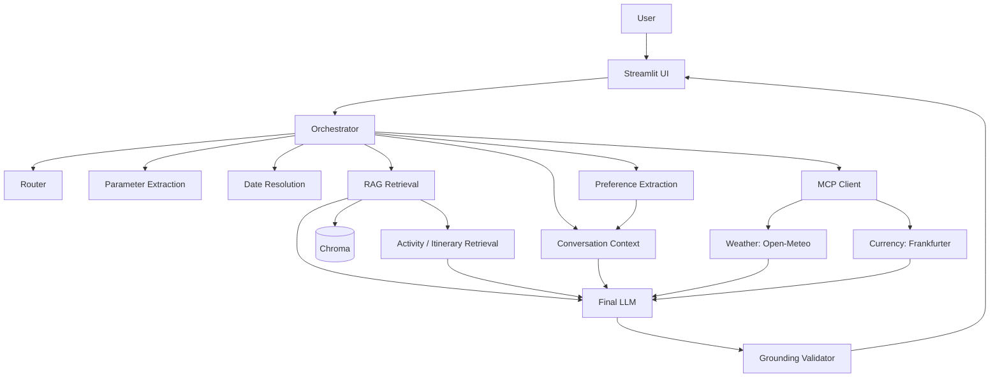

# Singapore Travel Assistant

**GitHub Repository:** [View the source code on GitHub](https://github.com/aashujain002/ai-travel-planning-assistant)

## 1. Project Overview

Singapore Travel Assistant is a grounded travel-planning application for Singapore.
It combines a local retrieval-augmented generation (RAG) knowledge base with live
weather and currency tools exposed through Model Context Protocol (MCP). A Streamlit
chat interface sends each request through routing, parameter extraction, date
resolution, retrieval, live-tool execution, grounding checks, and final synthesis.

The assistant distinguishes between:

- Stable destination knowledge retrieved from the knowledge base.
- Official day-by-day itinerary guidance when an exact itinerary match exists.
- Live weather and exchange-rate data retrieved through MCP.
- Clearly labeled AI recommendations grounded in the supplied evidence.

## 2. Assignment Requirements Covered

| Requirement            | Implementation                                                                   |
|------------------------|----------------------------------------------------------------------------------|
| RAG knowledge base     | Chroma-backed semantic retrieval over Singapore travel content                   |
| Grounded answers       | Evidence-aware final synthesis with source URLs and MCP provenance               |
| MCP weather tool       | `get_weather(location, start_date, end_date)` using Open-Meteo                   |
| MCP currency tool      | `get_currency_rate(amount, from_currency, to_currency)` using Frankfurter        |
| Tool selection         | Structured LLM router selects `rag`, `weather`, and/or `currency`                |
| Request parameters     | Structured extraction for locations, dates, durations, amounts, and currencies   |
| Weather-aware planning | Resolved date ranges are sent to Weather MCP alongside RAG evidence              |
| Conversation context   | In-memory user/assistant history and deterministic preference extraction         |
| Failure handling       | MCP exceptions become controlled unavailable states rather than fabricated data  |
| User interface         | Streamlit chat interface with session-persistent messages and conversation state |
| Public knowledge sources | Wikivoyage plus Visit Singapore planning and itinerary sources |

## 3. Architecture



## 4. RAG Pipeline

### Knowledge sources

The local corpus combines:

- [Wikivoyage Singapore Travel Guide](https://en.wikivoyage.org/wiki/Singapore)
- [Visit Singapore - Plan Your Trip](https://www.visitsingapore.com/mice/en/tools-and-resources/plan-your-trip/)
- Selected official Visit Singapore itinerary pages

Documents retain provenance metadata including source name, URL, topic, section, and,
for official itinerary documents, itinerary name and day number.

### Ingestion

`src/document_builder.py` builds LangChain `Document` objects from local raw source
files. The Wikivoyage HTML is cleaned before section parsing; Visit Singapore plan and
official itinerary content are parsed into structured sections.

### Chunking

`src/chunking.py` uses `RecursiveCharacterTextSplitter` with a chunk size of 1,200
characters and a 150-character overlap. Chunk metadata is preserved.

### Embeddings

The application uses OpenAI's `text-embedding-3-small` embedding model.

### Vector store

`src/vector_store.py` creates the persistent Chroma collection
`singapore_travel_knowledge` in `data/vectorstore/`. Chunk identifiers are
deterministic SHA-256 hashes of each chunk's content, metadata, and position.

### Retrieval

`src/rag.py` performs generic semantic retrieval with a default top four documents.

`src/activity_retrieval.py` retrieves the top eight activity-oriented documents from
the `activities`, `attractions`, and `food_and_local_experiences` topics. It enriches
indoor/rain and outdoor queries semantically without hard-coded document ranking.

`src/itinerary_retrieval.py` semantically selects an official itinerary with the
requested duration, then returns its day sections in deterministic day order.

### Grounded generation

The final synthesizer receives separate generic RAG, activity RAG, official itinerary,
weather MCP, and currency MCP evidence sections. It is instructed to use only supplied
evidence, distinguish source facts from AI recommendations, and cite knowledge-base
content.

## 5. MCP Integration

### Weather

`get_weather(location, start_date, end_date)` calls
[Open-Meteo](https://api.open-meteo.com/v1/forecast) for Singapore in the
`Asia/Singapore` timezone. It validates the location, ISO dates, date ordering, and
the supported 16-day forecast window. Successful synthesized answers include:

```text
Current-data source: Weather MCP (Open-Meteo).
```

### Currency

`get_currency_rate(amount, from_currency, to_currency)` calls
[Frankfurter](https://api.frankfurter.dev/v1/latest) with a caller-supplied base and
target currency. It validates positive finite amounts, three-letter ISO currency
codes, HTTP responses, JSON shape, rate availability, and rate dates. Successful
synthesized answers include:

```text
Current-data source: Currency MCP (Frankfurter).
```

### Tool selection

`src/router.py` uses structured LLM output to select one or more capabilities:
`rag`, `weather`, and `currency`. A weather-aware itinerary, for example, selects both
RAG and weather.

### Failure handling

MCP client failures are captured independently as `weather_error` or `currency_error`
in `CapabilityEvidence`. Synthesis receives a controlled unavailable status rather
than raw exception details, so one failed MCP tool does not discard successful
evidence from other capabilities. The assistant does not fabricate current forecasts
or exchange rates when live retrieval is unavailable.

## 6. Request Routing and Parameter Extraction

`src/request_parameters.py` extracts a structured `RequestParameters` model using
`gpt-4o-mini`. It supports:

- `location`
- `start_date` and `end_date`
- `date_expression`
- `duration_days`
- `amount`
- `from_currency` and `to_currency`

Validation keeps money amounts, trip durations, and dates separate. For example, a
`3-day itinerary` is a duration, not a currency amount.

## 7. Date Resolution

`src/date_resolver.py` resolves supported relative expressions using Singapore local
time. Explicit date ranges are preserved. A single explicit start date expands
inclusively when a duration is provided, so September 21 with a three-day duration
becomes September 21 through September 23.

`today`, `tomorrow`, and `next <weekday>` are supported. `next week` intentionally
requires a clarification because it does not identify a specific trip start date.

## 8. Conversation Context

### Conversation history

`src/conversation.py` maintains ordered user and assistant messages in memory for the
current process or Streamlit browser session. The final LLM receives this history as
context for preferences and references, not as authoritative travel knowledge.

### Preference extraction

`src/preference_extractor.py` deterministically extracts supported preferences:
cultural activities, food, outdoor activities, indoor activities, nature/wildlife,
and shopping. Preferences are merged without duplicates and persist for the current
conversation.

## 9. Grounding and Provenance

`src/grounding_validator.py` validates required Weather and Currency MCP provenance
labels when a successful live result exists. When RAG, activity, or official-itinerary
evidence exists, it also verifies that the answer contains at least one URL permitted
by the supplied documents.

If the first final-LLM response fails validation, the application performs one
evidence-preserving correction attempt. If that response still fails, it returns a
deterministic provenance-safe fallback. This validator does not perform entity-level
fact verification or prove that every named activity is grounded.

## 10. Streamlit UI

Run `src/app.py` with Streamlit for a session-persistent chat UI. It stores displayed
messages and `ConversationState` in `st.session_state`, delegates processing to the
existing orchestration functions, shows a centered first-load indicator and an
in-message processing indicator, and disables chat input while a request is running.

## 11. Project Structure

```text
src/
├── app.py                         # Streamlit UI
├── activity_retrieval.py          # Activity-focused semantic retrieval
├── conversation.py                # In-memory conversation state
├── date_resolver.py               # Deterministic relative-date resolution
├── document_builder.py            # Source documents and metadata
├── grounding_validator.py         # Provenance validation
├── itinerary_retrieval.py         # Ordered official-itinerary retrieval
├── mcp_client.py                  # Reusable MCP stdio client
├── mcp_server.py                  # Weather and currency MCP tools
├── orchestrator.py                # Routing, evidence execution, and synthesis
├── preference_extractor.py        # Deterministic preference matching
├── rag.py                         # Generic RAG retrieval and formatting
├── request_parameters.py          # Structured request extraction
├── router.py                      # Structured capability routing
├── section_parser.py              # Wikivoyage section parsing
├── vector_store.py                # Chroma build and loading
├── visit_itineraries_parser.py    # Official itinerary parsing
└── visit_singapore_parser.py      # Visit Singapore plan parsing

scripts/
├── _paths.py                      # Direct-script source import helper
├── activity_retrieval_evaluation.py
├── indoor_activity_check.py
├── inspect_itinerary_page.py
├── inspect_visit_itineraries.py
├── inspect_visit_sections.py
├── inspect_visit_singapore.py
├── mcp_client_test.py
├── mcp_failure_synthesis_test.py
├── mcp_failure_test.py
├── rag_evaluation.py
└── retrieval_test.py               # Vector-store retrieval diagnostic

tests/
└── acceptance_test.py             # End-to-end acceptance smoke runner

data/
├── raw/                           # Locally acquired source content
├── processed/                     # Processed source artifacts
└── vectorstore/                   # Generated Chroma persistence (ignored by Git)
```

`src/` contains production and application modules. `scripts/` contains data
inspection, retrieval evaluation, MCP connectivity, and failure-handling diagnostics.
`tests/` contains automated acceptance checks. Scripts are not required by the normal
Streamlit runtime; `src/vector_store.py` owns the reusable Chroma loader used by both
production retrieval and diagnostics.

## 12. Setup

Use Python 3.11+ and create a virtual environment:

```powershell
python -m venv .venv
.\.venv\Scripts\Activate.ps1
pip install -r requirements.txt
```

The main dependencies include LangChain, Chroma, OpenAI integrations, the MCP SDK,
Streamlit, BeautifulSoup, and HTTPX.

Create a `.env` file at the project root:

```text
OPENAI_API_KEY=your_openai_api_key
```

The repository includes the acquired Wikivoyage and Visit Singapore planning source
files in `data/raw/`. During vector-store construction, `load_all_documents()` also
fetches the selected official Visit Singapore itinerary pages, so network access is
required.

Build the local vector store:

```powershell
python src\vector_store.py
```

## 13. Running the Application

Start the Streamlit application:

```powershell
streamlit run src\app.py
```

Open the local URL printed by Streamlit, normally `http://localhost:8501`.

Before submission, verify the implementation with:

```powershell
python tests\acceptance_test.py
```

For a CLI orchestration demonstration:

```powershell
python src\orchestrator.py
```

The MCP client starts the local MCP server over stdio when a live tool is needed; a
separate MCP server process is not required for normal application use.

## 14. Running Tests

Run the acceptance smoke suite:

```powershell
python tests\acceptance_test.py
```

The runner currently checks:

```text
PASS: RAG factual answer
PASS: Activity retrieval
PASS: Official itinerary
PASS: Missing official itinerary
PASS: Weather MCP
PASS: Currency MCP
PASS: Combined RAG + MCP
PASS: Ambiguous relative date
PASS: Multi-turn context
PASS: MCP failure
```

The suite uses live OpenAI, Open-Meteo, and Frankfurter calls for successful-path
checks, so it requires network access and valid OpenAI credentials.

## 15. Sample Questions and Behavior

### Indoor activities

```text
What are indoor activities in Singapore?
```

Representative output excerpt:

```text
Here are some indoor activities you can enjoy in Singapore:

Indoor Snow Activities: Visit Snow City, a permanent indoor snow center where you can play in the snow or learn to ski and snowboard with certified instructors. Ice skating is also available at Kallang Ice World at Leisure Park Kallang (Wikivoyage Singapore Travel Guide).

Cultural Performances: Attend performances at the Esplanade theatre in Marina Bay, which hosts a variety of cultural events, including concerts by the Singapore Symphony Orchestra and the Singapore Chinese Orchestra (Wikivoyage Singapore Travel Guide).

Movies: Enjoy a movie at one of the major cinema chains like Carnival Cinemas, Golden Village, or Shaw Brothers. Look for films with "NC16," "M18," or "R21" ratings for fewer cuts (Wikivoyage Singapore Travel Guide).

Gambling: Try your luck at one of Singapore's two massive casinos, Marina Bay Sands or Resorts World Sentosa. Foreign visitors can enter for free with a passport (Wikivoyage Singapore Travel Guide).

Shopping: Explore the numerous shopping malls concentrated in Orchard Road, Bugis, and Marina Bay, where you can find a variety of retail options (Wikivoyage Singapore Travel Guide).

These activities provide a mix of entertainment, culture, and leisure, perfect for indoor enjoyment in Singapore.
```

### Currency conversion

```text
Convert 100 SGD to INR.
```

Representative output excerpt; rates are live and therefore change:

```text
100 SGD is equivalent to 7541.40 INR, based on the exchange rate of 1 SGD = 75.414 INR.

Current-data source: Currency MCP (Frankfurter).
```

### Official itinerary

```text
Give me a 4-day Singapore itinerary.
```

Retrieves the matching official four-day itinerary sections in Day 1 through Day 4
order.

```text
Here is a 4-day itinerary for your trip to Singapore:

Day 1: Explore the City
Morning: Start your day with breakfast in Kampong Gelam, a culturally rich area. Enjoy a classic Singapore-style breakfast at Zam Zam Restaurant, known for its prata and curry. Then, explore Haji Lane, a hipster area with indie shops.
Afternoon: Head to the Civic District for lunch at Raffles Hotel, followed by a visit to Long Bar, the birthplace of the Singapore Sling cocktail. Conclude your afternoon at the National Gallery Singapore, showcasing modern Southeast Asian art.
Evening: Take a traditional bumboat cruise on the Singapore River. For dinner, visit Offtrack for Pan Asian cuisine and cocktails, or PLUME for unique cocktails and appetizers.
Day 2: Visit Neighborhoods
Morning: Explore the Katong-Joo Chiat area, famous for its colorful heritage shophouses. Enjoy breakfast at Chin Mee Chin Confectionery, known for its fluffy buns and kaya jam. Visit Kim Choo Kueh Chang for Peranakan culture souvenirs.
Afternoon: Discover Chinatown, where you can visit Maxwell Food Centre for local chicken rice and sugarcane juice, followed by the Buddha Tooth Relic Temple.
Evening: Experience the iconic Marina Bay area, shop at The Shoppes at Marina Bay Sands, and enjoy a seafood dinner at Red House Seafood.
Day 3: Be One with Nature (plus a spot of shopping)
Morning: Visit the Singapore Botanic Gardens, a UNESCO World Heritage Site, and the National Orchid Garden. Enjoy brunch at The Halia, located in the Ginger Garden.
Afternoon: Head to Orchard Road for shopping, then visit Design Orchard for local fashion and lifestyle brands. Enjoy Peranakan cuisine at Violet Oon.
Evening: Explore Bugis Street Market for bargains, then head to Little India for dinner at Banana Leaf Apolo, famous for fish head curry. Finish your day at Mustafa Centre, a 24-hour shopping complex.
Day 4: Animals Galore
Morning: Visit Mandai to explore the Bird Paradise, home to over 3,500 birds, or the Singapore Zoo, known for its free-roaming animals.
Evening: Enjoy a meal at Mandai Wildlife West, then embark on the Night Safari, the world's first nocturnal safari experience.
This itinerary offers a mix of cultural experiences, nature, and culinary delights, ensuring a well-rounded visit to Singapore.

Source: Visit Singapore – Official Itineraries
```

### Weather-aware planning

```text
Plan a 3-day Singapore itinerary starting September 21, 2026 and adjust it based on the weather.
```

Representative output excerpt:

```text
Here is a 3-day itinerary for your trip to Singapore starting September 21, 2026, adjusted based on the weather forecast.

Day 1: September 21, 2026
Morning: Start your day with breakfast in Kampong Gelam. Explore Haji Lane, a vibrant area with indie shops. Expect slight rain showers, so consider bringing an umbrella.
Afternoon: Visit the National Gallery Singapore to enjoy modern Southeast Asian art. Given the weather, this indoor activity is a great choice (Wikivoyage Singapore Travel Guide).
Evening: Take a traditional bumboat cruise on the Singapore River. For dinner, visit Offtrack for Pan Asian cuisine or PLUME for unique cocktails and appetizers.
Day 2: September 22, 2026
Morning: Explore the Katong-Joo Chiat area, famous for its colorful heritage shophouses. Enjoy breakfast at Chin Mee Chin Confectionery. Expect moderate drizzle, so plan for indoor activities if needed.
Afternoon: Discover Chinatown, where you can visit Maxwell Food Centre for local chicken rice and sugarcane juice, followed by the Buddha Tooth Relic Temple (Wikivoyage Singapore Travel Guide).
Evening: Experience the iconic Marina Bay area, shop at The Shoppes at Marina Bay Sands, and enjoy a seafood dinner at Red House Seafood (Wikivoyage Singapore Travel Guide).
Day 3: September 23, 2026
Morning: Visit Mandai to explore the Bird Paradise or the Singapore Zoo. Light drizzle is expected, so dress accordingly (Wikivoyage Singapore Travel Guide).
Afternoon: Enjoy lunch at Mandai Wildlife West. If the weather permits, consider a scenic walk along the Mandai Boardwalk (Wikivoyage Singapore Travel Guide).
Evening: Embark on the Night Safari, the world's first nocturnal safari experience (Wikivoyage Singapore Travel Guide).
This itinerary offers a mix of cultural experiences, nature, and culinary delights, ensuring a well-rounded visit to Singapore while considering the weather conditions.

Current-data source: Weather MCP (Open-Meteo).
```

### Multi-turn preferences

```text
I prefer cultural activities and food.
I also enjoy shopping.
What should I do tomorrow?
```

The current conversation retains the extracted cultural, food, and shopping
preferences. Final synthesis uses them as context while destination facts continue to
come from retrieved evidence.

```text
Based on your preferences for cultural activities, food, and shopping, here are some suggestions for what you can do tomorrow in Singapore:

Cultural Exploration: Visit the Sri Mariamman Temple in Chinatown, which is the oldest Hindu temple in Singapore. It's a beautiful site that showcases intricate architecture and is open to visitors outside of service times (Wikivoyage Singapore Travel Guide).

Food Experience: Head to a hawker centre for an authentic local food experience. You can try various dishes at affordable prices, such as chicken rice, laksa, or satay. Popular hawker centres include Maxwell Food Centre and Lau Pa Sat (Wikivoyage Singapore Travel Guide).

Shopping: Spend some time shopping in Orchard Road, which is known for its concentration of shopping malls. You can find everything from luxury brands to local boutiques (Wikivoyage Singapore Travel Guide).

Cultural Performance: If you're interested in the arts, check out what's on at the Esplanade theatre. It often hosts performances by the Singapore Symphony Orchestra and other cultural events (Wikivoyage Singapore Travel Guide).

These activities will allow you to immerse yourself in Singapore's rich culture while enjoying delicious food and shopping opportunities.
```

## 16. Data Sources

| Source                                                                                                                                     | Use                                                                                            |
|--------------------------------------------------------------------------------------------------------------------------------------------|------------------------------------------------------------------------------------------------|
| [Wikivoyage Singapore](https://en.wikivoyage.org/wiki/Singapore)                                                                           | General destination, activity, attraction, food, neighbourhood, and practical-travel knowledge |
| [Visit Singapore - Plan Your Trip](https://www.visitsingapore.com/mice/en/tools-and-resources/plan-your-trip/)                             | Stable official planning guidance                                                              |
| [4 Days in Singapore](https://www.visitsingapore.com/travel-tips/travelling-to-singapore/itineraries/4-days-in-singapore/)                 | Official four-day itinerary sections                                                           |
| [Enjoy Singapore in 7 Days](https://www.visitsingapore.com/travel-tips/travelling-to-singapore/itineraries/7-days-in-singapore/)           | Official seven-day itinerary sections                                                          |
| [Family Getaway in Singapore](https://www.visitsingapore.com/travel-tips/travelling-to-singapore/itineraries/places-to-visit-with-family/) | Official family itinerary sections                                                             |
| [Open-Meteo](https://open-meteo.com/)                                                                                                      | Live Singapore weather forecasts                                                               |
| [Frankfurter](https://www.frankfurter.app/)                                                                                                | Live currency exchange rates                                                                   |

## 17. Known Limitations

- Weather MCP currently supports Singapore only and only within Open-Meteo's 16-day
  forecast window.
- `next week` is intentionally treated as ambiguous and prompts for a specific start
  date.
- The official itinerary corpus currently includes four-day, seven-day, and family
  itinerary material. A requested dedicated official three-day itinerary is reported
  as unavailable.
- When no matching official itinerary exists, the assistant may provide a clearly
  labeled AI recommendation only from available activity evidence; it does not claim
  that recommendation is official.
- Conversation and preferences are in memory only and are lost when the process or
  Streamlit session ends.
- Conversation history informs final synthesis only; routing and parameter extraction
  currently operate on the current user message.
- The grounding validator checks MCP labels and permitted knowledge-base URLs, not
  entity-level factual support for every generated statement.
- Live successful-path behavior depends on OpenAI credentials, network access, and
  external API availability.
